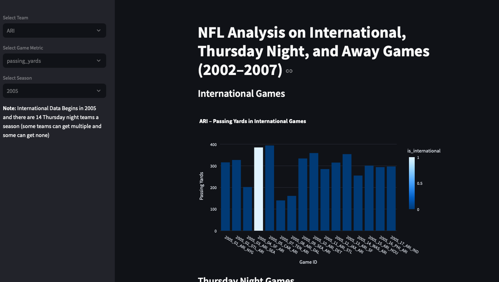

# saxa-fl

A data analysis project focused on visualizing and exploring NFL game data using Python and Streamlit. This project includes historical and next-gen stats, and surfaces patterns across seasons, teams, and game conditions like away games, international games, and Thursday night matchups.

---

## Project Overview

### `ExtractNFLData.py`
Some key datasets were not directly available through Python packages, so I extracted the following from an R package:

- `NextGenDict`
- `NextGenData` (2016–2024)
- `PlayByPlayDict`
- `PlayByPlay` (2002–2024)
- `ScheduleOutcomeDataDict`
- `ScheduleOutcomeData`

### `EDA.py`
To streamline exploration, I created a **Streamlit** dashboard that allows flipping through multiple teams and visualizing key performance metrics in one place—helping to identify trends and patterns.

### `app.py`
The main application visualizes various conditions such as:

- Away games
- Thursday night games
- International games

Currently focused on 2002–2007, with work in progress to overlap datasets and improve long-term visualization.

---

## Data 
I had some issues with uploading the data so I uploaded those into a file in our google drive if you download the full folder path into "data folder" this code should run. 
# Capstone_App
